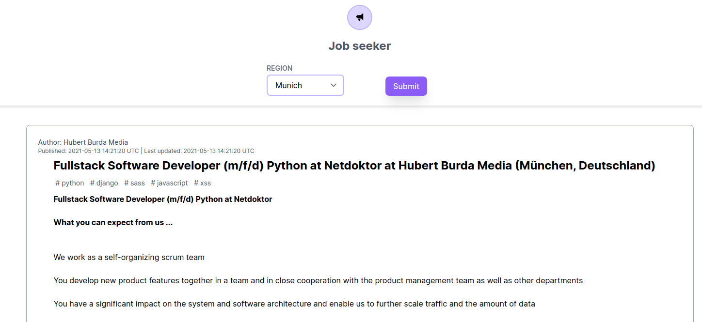

# Job seeker

This repository contains the code for a demo application that grants users the ability to search for jobs in Munich.

---



---

## Installation

The app can be ran standalone, as well as on Docker.
The installation provides instructions for usage on Docker.

You need:

- `docker` and `docker-compose` installed.
- [`dip`](https://github.com/bibendi/dip) installed.

Run the following command to build images and provision the application:
```sh
dip provision
```

## Running the app
You can start Rails server by running:
```sh
dip up
```
Then go to [http://localhost:3000/](http://localhost:3000/) and see the application in action.

**Note**: If you're too fast, you might experience some lag on first request.
This is normal, as webpacker is compilling the assets.
Once the compilation is finished, you should be good to go!

## Debugging

If you want to run the Rails console, run the following command:

```sh
dip rails c
```

### Expiring the cache

Jobs stay on the memory store for 5 minutes until they are expired.
If you want them to be expired sooner, then run the following commands:

```sh
dip rails c
Rails.cache.delete('retrieve_jobs_cache')
```

## Testing

You can run the tests with:

```sh
dip rspec
```

## Used Technologies

- Redis -> as a cache store
- Stimulus -> as a JS framework
- TailwindCSS -> utility-first CSS framework
- Docker and Docker compose -> as an application wrapper
- Ruby 3.0.0
- Ruby on Rails 6.1.3.2 having the following libraries:
* Rspec - as a test framework
* Turbo - as an enabler for great UI speed
* Http - as the fastest Ruby HTTP library used to interact with APIs
* Sidekiq - as the async job handler
* Feedjira - efficient feed parser
* and more..

## Resources
- [Hotwire: Reactive Rails with no JavaScript?](https://evilmartians.com/chronicles/hotwire-reactive-rails-with-no-javascript) — learn about an inspirational post from evilmartians, where they encourage Rails developers to be Fullstack again, when the time is right.
- [HOTWire HNPWA](https://onrails.blog/2020/12/23/building-hhnpwa-1-setting-up-for-top-stories/) — some ideas for PWA are borrowed from this post.
- [Hotwire, ViewComponents and TailwindCSS: The Ultimate Rails Stack](https://blog.cloud66.com/hotwire-viewcomponents-and-tailwindcss-the-ultimate-rails-stack/) — excellent resource for an introduction to clean, reusable bits of code for back and front-end using Hotwire, ViewComponents and TailwindCSS.

## Acknowledgments

Built and tested with the help of these awesome technologies:

- [Hotwire](https://hotwire.dev/)
- [Tailwind CSS](https://tailwindcss.com)
- [Tailwind Play](https://play.tailwindcss.com/)

---

### Background story

Coding challenge with fixed constraints.

#### Constraint

1. Usage of either Stackoverflow or Github APIs.
2. Assumption: Stackoverflow or Github APIs are slow and that they take, in some cases, up to 1 minute to give the result.
Application is therefore designed for users to first submit a search query (fixed to Munich) and wait until the results are available while they fetched are from the API in the background.

3. Bleeding edge technology.
4. Test cases.
5. Dockerized application
6. Concerning the life cycle of the job updates:
   Choice between:
- Polling for results
- [Chosen solution] Waiting for results on a websocket/sse(server send event)
7. Application should not persist data under a database like MySQL/PostgreSQL .
8. Application is allowed to temporarily cache (5 minutes).
9. It goes without saying that code should be in good shape (refactored).

## License

The application is available as open source under the terms of the [MIT License](http://opensource.org/licenses/MIT).